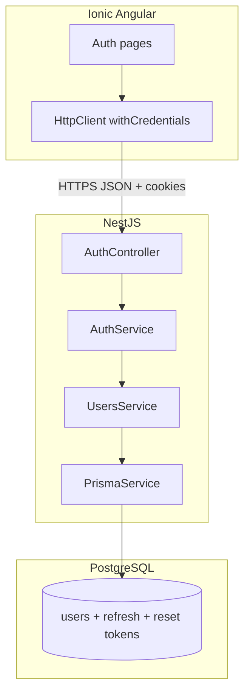

# Phase 1: Platform & auth - Research

**Researched:** 2026-04-24  
**Domain:** NestJS API + PostgreSQL + cookie-based JWT refresh + Ionic/Angular client  
**Confidence:** HIGH (stack aligned with CONTEXT lock-ins); MEDIUM (Capacitor cookie edge cases on device)

## Summary

Phase 1 establishes a **NestJS** backend with **PostgreSQL**, implements **email/password auth** with **short-lived access tokens** and **refresh tokens** in **httpOnly cookies** (per CONTEXT D-01/D-02), **password reset** with **dev logging** of reset links (D-04), and **Ionic** screens for register/login/reset/profile honoring **01-UI-SPEC.md** and **DESIGN.md**. The client is Angular 20 standalone with no HTTP/auth layer yet — greenfield wiring.

**Primary recommendation:** Use **Prisma** for schema and migrations, **@nestjs/passport** + **passport-jwt** (access) + custom refresh rotation in a dedicated `AuthService`, **bcrypt** for passwords, **class-validator** on DTOs, and **Helmet** + strict **CORS** (`credentials: true`, explicit origin list). Add a **[BLOCKING]** `npx prisma db push` (or `migrate dev`) task after schema edits to avoid false-positive verification.

## User Constraints

Copied from `01-CONTEXT.md` — **non-negotiable for planners and executors.**

- **D-01 / D-02:** Short-lived access token + refresh token; store/deliver via **httpOnly cookies** (not long-lived tokens in `localStorage`).
- **D-03:** **NestJS** for the API server.
- **D-04:** **Development logging** of password-reset links/tokens in Phase 1; documented swap path to transactional email (Resend/SendGrid/SES).
- **D-05:** Profile fields for bookings: **name**, **email**, **phone** — readable/updatable by owning user.
- **D-06:** **iOS bundle (Capacitor)** in milestone 1 — verify auth persistence in **packaged app** (simulator + device): WKWebView cookies, `SameSite`/`Secure` if API origin differs from app origin, CORS credentials, Capacitor constraints.

## Architectural Responsibility Map

| Capability | Primary Tier | Secondary Tier | Rationale |
|------------|--------------|----------------|-----------|
| Credential verification | API (Nest) | — | Server is source of truth |
| Session continuity | API + httpOnly cookies | Ionic `HttpClient` with `withCredentials` | Refresh rotation server-side |
| Password reset token | API | DB table `PasswordResetToken` | One-time, expiring, hashed storage optional |
| Profile CRUD | API | Ionic pages | Owner-scoped by JWT sub |
| TLS/cookie policy | Reverse proxy + Nest cookie options | Capacitor config | D-06 cross-origin |

## Standard Stack

### Core

| Library | Version | Purpose | Why Standard |
|---------|---------|---------|----------------|
| @nestjs/core | 11.1.19 [VERIFIED: npm registry] | HTTP API, DI, modules | User lock-in D-03 |
| @nestjs/config | [ASSUMED] latest 11.x | Env loading | Nest idiomatic |
| @prisma/client | 7.8.0 [VERIFIED: npm registry] | ORM + migrations | Type-safe schema; `prisma db push` for dev |
| passport / @nestjs/passport | 0.7.0 / 11.0.5 [VERIFIED] | Auth guards | Nest integration |
| @nestjs/jwt | 11.0.2 [VERIFIED] | Access JWT sign/verify | Industry default with Nest |
| bcrypt | 6.0.0 [VERIFIED] | Password hashing | Well-understood cost factor |

### Supporting

| Library | Version | Purpose | When to Use |
|---------|---------|-------------|-------------|
| class-validator / class-transformer | [ASSUMED] Nest defaults | DTO validation | All auth/profile bodies |
| cookie-parser | [ASSUMED] | Parse `Cookie` header | Refresh cookie reads |
| helmet | [ASSUMED] | Security headers | Production-minded defaults |

### Alternatives Considered

| Instead of | Could Use | Tradeoff |
|------------|-----------|----------|
| Prisma | TypeORM | Both fine; Prisma gives clearer migration story for greenfield [ASSUMED] |
| passport-jwt | @nestjs/jwt only in middleware | passport-jwt integrates cleanly with `AuthGuard('jwt')` [CITED: Nest docs patterns] |

**Installation (backend workspace):** `npm install @nestjs/core @nestjs/common @nestjs/platform-express ...` (executor fills exact set from plan).

## Architecture Patterns

### System Architecture Diagram



### Recommended Project Structure

```
backend/
├── prisma/
│   └── schema.prisma
├── src/
│   ├── main.ts
│   ├── app.module.ts
│   ├── prisma/
│   ├── health/
│   ├── auth/
│   ├── users/
│   └── profile/   # or users/profile — discretion
```

### Pattern: httpOnly dual-cookie auth

**What:** Access JWT (15m typical) + refresh token (7d typical, opaque UUID in DB); both Set-Cookie httpOnly Secure SameSite=Lax (or Strict for same-site).  
**When:** Per D-01/D-02.  
**Example:** [ASSUMED] Nest `res.cookie('access_token', jwt, { httpOnly, secure, sameSite })` after login; refresh in separate cookie; rotation on `/auth/refresh`.

### Anti-Patterns to Avoid

- **Tokens in localStorage:** Violates D-01/D-02 and fails ASVS session guidance for XSS exposure.
- **Wildcard CORS with credentials:** Browsers reject `*` with credentials — list explicit dev/prod origins.
- **Logging raw passwords:** Never log request bodies for auth routes.

## Don't Hand-Roll

| Problem | Don't Build | Use Instead | Why |
|---------|-------------|-------------|-----|
| Password hashing | Custom scrypt wrapper | bcrypt (cost 12+) | Timing-safe, audited |
| JWT parsing in controllers | String splits | @nestjs/jwt + guards | Algorithm confusion, expiry |
| SQL for users | Raw queries everywhere | Prisma | Injection-safe parameterization |

## Common Pitfalls

### Pitfall: Capacitor WKWebView and cross-origin cookies

**What goes wrong:** Refresh cookie not sent on API calls when API host ≠ app origin.  
**Why:** SameSite and iOS ITP behavior.  
**How to avoid:** Document `API_URL`, use dev proxy (`proxy.conf.json`) where possible, set `withCredentials: true`, align `Secure` with HTTPS dev (mkcert) or tunnel. **D-06 checkpoint:** manual device test task.

### Pitfall: Prisma schema drift

**What goes wrong:** Types compile but DB has no columns — tests pass falsely.  
**How to avoid:** **[BLOCKING]** `npx prisma db push` after schema changes (workflow schema gate).

## Code Examples

### Nest health module

```typescript
// Source: [ASSUMED] NestJS docs — HealthCheckService pattern
@Controller('health')
export class HealthController {
  @Get()
  check() {
    return { status: 'ok', timestamp: new Date().toISOString() };
  }
}
```

## State of the Art

| Old Approach | Current Approach | Impact |
|--------------|------------------|--------|
| localStorage JWT | httpOnly cookies + refresh rotation | XSS cannot steal long-lived session |

## Assumptions Log

| # | Claim | Section | Risk if Wrong |
|---|-------|---------|-----------------|
| A1 | Prisma 7.x works with Nest 11 without adapter quirks | Standard Stack | Executor may need `@prisma/nestjs-prisma` pattern |
| A2 | `passport-jwt` from cookie extractor is supported with custom `JwtStrategy` | Patterns | May need custom `ExtractJwt.fromExtractors` |

**Open Questions:** None blocking — TTLs and cookie names are discretion per CONTEXT.

## Environment Availability

| Dependency | Required By | Available | Version | Fallback |
|------------|-------------|-----------|---------|----------|
| PostgreSQL | Prisma | ✓ local/docker | 15+ | SQLite not acceptable for phase goal |
| Node 20+ | Nest + Angular | ✓ | LTS | — |

## Validation Architecture

### Test Framework

| Property | Value |
|----------|-------|
| Framework | Backend: **Jest** (Nest default) + **supertest** for HTTP; Client: **Karma + Jasmine** (existing `ng test`) |
| Config file | `backend/package.json` jest block (Wave 0); `karma.conf.js` at repo root |
| Quick run command | `cd backend && npm test` (after Wave 0); `npm test` (client) |
| Full suite command | Same sequentially in CI script later |

### Phase Requirements → Test Map

| Req ID | Behavior | Test Type | Automated Command | File Exists? |
|--------|----------|-----------|-------------------|--------------|
| AUTH-01 | POST signup creates user | e2e | `npm test -- auth.e2e` | ❌ Wave 0 |
| AUTH-02 | Refresh cookie rotates | e2e | `npm test -- session.e2e` | ❌ Wave 0 |
| AUTH-03 | Logout clears cookies | e2e | `npm test -- auth.e2e` | ❌ Wave 0 |
| AUTH-04 | Reset token flow | e2e | `npm test -- reset.e2e` | ❌ Wave 0 |
| AUTH-05 | Profile GET/PATCH owner | e2e | `npm test -- profile.e2e` | ❌ Wave 0 |

### Sampling Rate

- **Per task commit:** Quick backend unit/e2e where exists; `ng test` smoke for client tasks.
- **Per wave merge:** Full `backend` + `ng test` (headless).
- **Phase gate:** All green before `/gsd-verify-work`.

### Wave 0 Gaps

- [ ] `backend/test/jest-e2e.json` + `*.e2e-spec.ts` stubs for AUTH-* flows
- [ ] `backend/src/**/*.spec.ts` unit stubs for `AuthService` password verify
- [ ] Client: optional `HttpClient` test harness — minimum `ng test` runs 1 sanity spec

---

## Security Domain (ASVS L1 alignment)

| Area | Guidance |
|------|----------|
| Authentication | bcrypt; lockout optional v1; rate-limit auth routes [ASSUMED] `@nestjs/throttler` |
| Session | httpOnly; short access TTL; refresh rotation invalidates reuse |
| Transport | HTTPS in staging/prod; Secure cookies |
| Logging | No password or raw reset token in prod logs; D-04 dev logging clearly gated by `NODE_ENV` |

## RESEARCH COMPLETE
