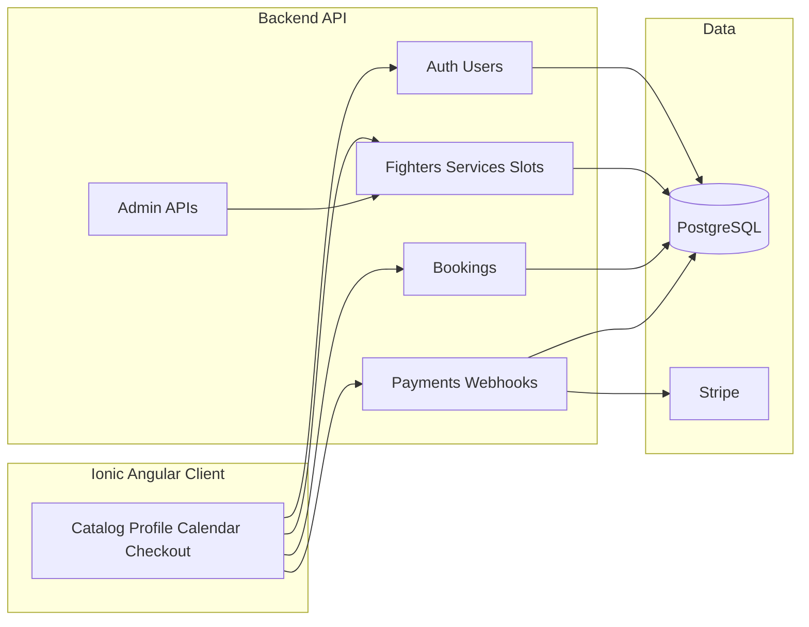

# Research — Architecture (Champ)

## Major components

## Data flow (happy path)

1. Client loads **published** fighters and services (read-heavy, cacheable).
2. Client requests **available slots** for `(fighterId, serviceId, range)` — server computes from schedule rules, existing bookings, holds.
3. **Booking draft/hold** created server-side with TTL (optional but recommended).
4. Client starts **Stripe Checkout** with `bookingId` metadata.
5. **Webhook** confirms payment → booking becomes `confirmed`, slot consumed; notification emitted.

## Boundaries

- **Browser never trusts** “slot is free” without server confirmation.
- **Admin** mutates source-of-truth schedules; public reads go through versioned or cached reads if needed.

## Suggested build order

1. DB schema + auth + health check.
2. Fighters + services + admin CRUD (seed data possible before calendar).
3. Slot generation + listing API.
4. Booking + payment + webhooks.
5. Ionic flows wired end-to-end + “My bookings” + notifications.
